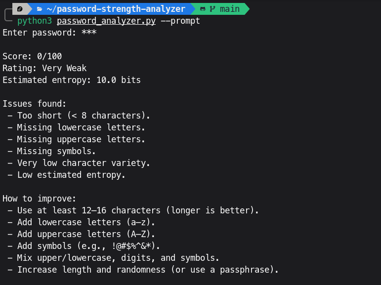

# Password Strength Analyzer (Python CLI)

A simple, self-contained **password strength analyzer** written in Python. It scores a password (0–100), assigns a rating, estimates entropy, flags common weaknesses (short length, low variety, repeats, sequences, keyboard patterns, common words), and can optionally:

- **Suggest** stronger alternatives (random passwords + passphrases)
- **Prevent password reuse** per user (local SQLite history)
- **Store password history** securely using **PBKDF2-HMAC-SHA256**



## Features

- Strength score + rating (Very Weak → Very Strong)
- Estimated entropy (bits)
- Detection of weak patterns:
  - too short / low character variety
  - repeated characters (e.g., `aaaa`)
  - simple sequences (e.g., `abcde`, `12345` and reverse)
  - keyboard walks (e.g., `qwerty`, `asdf`)
  - common words / patterns (e.g., `password`, `admin`, `welcome`)
- Optional suggestions:
  - memorable **passphrases** (hyphen-separated words + a digit + a symbol)
  - **random passwords** from selected character sets
- Optional local password history:
  - reuse checks per username
  - PBKDF2 hashing with a per-entry random salt
  - stored in a local SQLite database file

## Requirements

- Python **3.9+** (should work on most Python 3.x versions)
- No third-party dependencies

## Usage

### 1) Analyze a password (recommended: prompt)

```bash
python3 password_analyzer.py --prompt
```

If you run without arguments, it defaults to prompting:

```bash
python3 password_analyzer.py
```

### 2) Analyze a password via CLI argument (not recommended)

Passing a password on the command line can leak it via shell history or process lists.

```bash
python3 password_analyzer.py --password "MyP@ssw0rd123"
```

### 3) Print suggestions

```bash
python3 password_analyzer.py --prompt --suggest
```

Control how many suggestions you want:

```bash
python3 password_analyzer.py --prompt --suggest --num-suggestions 5
```

### 4) Enable local history / prevent reuse

Check whether a password was used before for a given user:

```bash
python3 password_analyzer.py --prompt --user alice --prevent-reuse
```

If the password is found in history, the program exits with code **2**.

### 5) Store a password hash in the local history database

```bash
python3 password_analyzer.py --prompt --user alice --store
```

By default, history is stored in `password_history.sqlite`. You can override it:

```bash
python3 password_analyzer.py --prompt --user alice --store --history-db ./my_history.sqlite
```

## How scoring works (high-level)

The analyzer starts from a baseline score and adjusts based on:

- **Length** (penalizes < 8, slightly penalizes 8–11, rewards 16+)
- **Character classes** (lower/upper/digit/symbol)
- **Pattern penalties** (repeats, sequences, keyboard walks, common words)
- **Entropy estimate** based on detected character set size

Final score is clamped to **0–100**, and mapped to a rating:

- `< 20` Very Weak
- `< 40` Weak
- `< 60` Fair
- `< 80` Strong
- `>= 80` Very Strong

## Notes / Security

- Password history uses **PBKDF2-HMAC-SHA256** with a per-entry random salt.
- This is a learning/demo project; for production systems, prefer mature libraries and enforce policies server-side.

## Project structure

- `password_analyzer.py` — CLI tool + analysis + optional history + generators
- `output.png` — example output screenshot

## License

No license file is included. If you want others to use/modify this project, consider adding a license (e.g., MIT).
